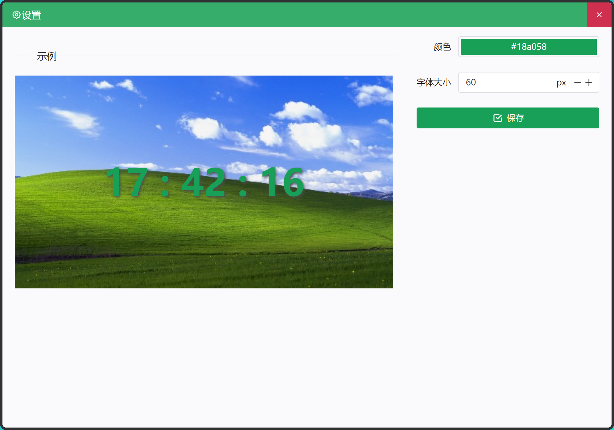

  

<h1 align="center">cool-clock</h1>

vue3 + ts + electron

windows下的桌面时钟应用

  

## 已实现功能

- [x] 拖拽移动
- [x] 拖拽位置记录
- [x] 颜色字体大小自定义
- [x] 开机自启动
- [x] 任务栏托盘

## 安装包下载地址

[腾讯微云 cool-clock](https://share.weiyun.com/J9y3U3tV)