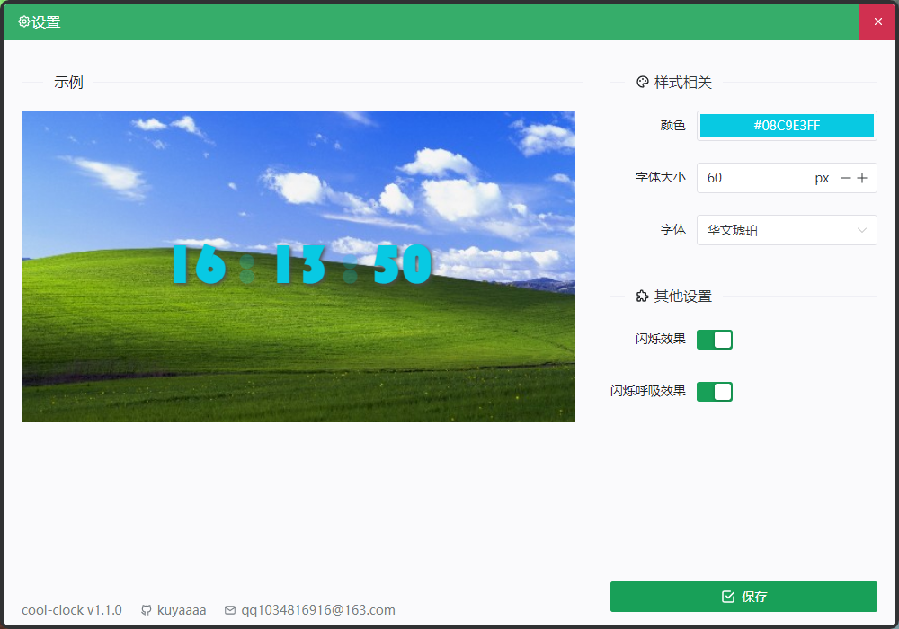

  

<h1 align="center">cool-clock</h1>

vue3 + ts + electron

windows下的桌面时钟应用

  

## 已实现功能

- [x] 拖拽移动
- [x] 拖拽位置记录
- [x] 颜色字体大小自定义
- [x] 开机自启动
- [x] 开机自启设置
- [x] 任务栏托盘
- [x] 双击任务栏托盘复位时钟位置
- [x] 字体设置
- [x] 呼吸灯/闪烁效果

## 安装包下载地址

[cool-clock release](https://github.com/kuyaaaa/electron-cool-clock/releases)